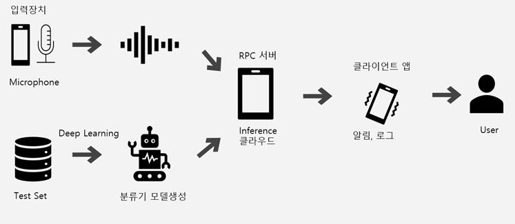
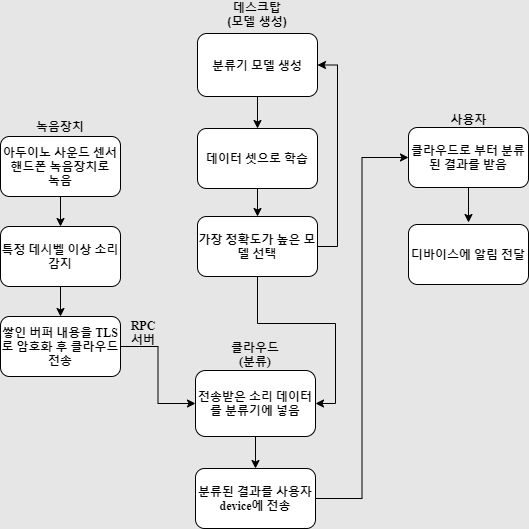
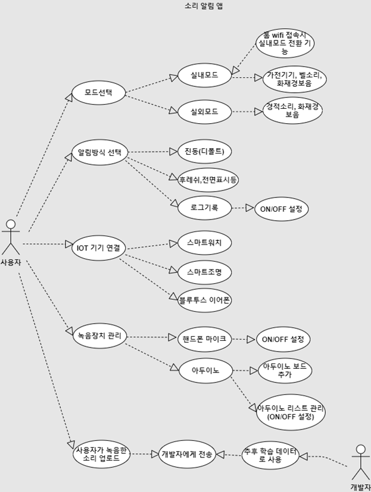
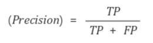
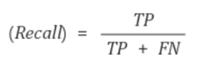
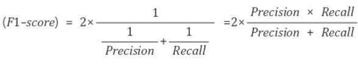

주제 : 주변의 비언어적 소리를 딥러닝을 통해 분류하여 알림으로 받아보는 서비스

팀명 : 귀가되어조

구성원 : 정세종 (팀장), 이민재, 정진주

 

## **0.**  **목차**

1) 요약

2) 배경 : 동기, 목적, 기대효과, 유사 프로젝트, 문제점, 대안

3) 개발내용 : 기능적 요구사항, 시나리오/소리종류/출력기기별 방안, 비기능적 요구사항

4) 개발방법 : 시스템 흐름도, use case 다이어그램

5) 계획 및 일정 : 간트차트

6) 최종 평가

7) 참고문헌

 

## **1.**  **요약**

Figure 1구성도

주제 : 가정에서 나오는 다양한 소리를 인식해서 여러 장치로 알려주는 서비스

부제 : 청각장애인 또는 주변 소리를 듣기 어려운 상황에 놓인 사람들을 위한 경보알림 서비스

 

## **2.**  **배경**

1) ### 동기

   a.  시중에 스마트 가전제품들이 출시되어 있지만 가격이 비쌀 뿐 아니라 단지 스마트 기능을 이용하기 위해 원래 사용 중이던 제품을 바꾸기는 현실적으로 어렵다.

   b.  최근 노이즈 캔슬링의 기능이 있는 이어폰이 많이 쓰임에 따라 주변 소리를 듣지 못하는 경우가 발생한다.

   c.   소리를 듣지 못하는 청각장애인의 경우 경보음이 발생했을 때 이를 인지하지 못하여 위험에 노출될 수 있다.

2) ### 목적

   a.  청각장애인 뿐만 아니라 소리를 잘 듣지 못하는 상황에 있는 사람들도 사용할 수 있는 앱을 만들어 범용성을 높인다.

   b.  많은 소리를 분류하는 것 보다 실생활에 필요한 소리만 분류해 실용성을 높인다.

   c.   상대적으로 중요한 경보음 같은 소리는 최소 95프로 이상, 나머지 소리는 90프로 이상의 정확도를 목표로 한다.

3) ### 기대효과

   a.  일상생활 가정의 사람들과 청각장애인의 삶의 질을 향상시킨다. 

   b.  위험한 상황에서 경보음을 쉽게 감지할 수 있도록 한다.

   c.   비싼 장비나 경보기에 제한적이고 종속적이었던 알람서비스를 저렴하게 보급한다.

   d.  IoT 기술이 탑재되지 않은 가전기기(세탁기, 건조기 등)로부터 알림을 받을 수 있다.

4) ### 유사 프로젝트

   a.  소리우산 : ‘소리우산 밴드’라는 15만원 상당의 스마트밴드 장치가 필요하다. 보호자 연락처를 따로 등록하여 위험시 보호자에게 문자를 보낸다.

   b.  Woof : 갤럭시기어에만 사용가능하다. 사용자가 원하는 소리는 개발자에게 직접 메일로 신청하는 서비스가 있다. 보호자는 웹에서 로그를 볼 수 있다. 

5) ### 문제점

   a.  특정 기기에 종속적이다.

   b.  디폴트로 사용가능한 기기의 가격이 비싸다.

   c.   화재 경보음이나 경적소리 등 종류가 제한적이다. 

6) ### 대안

   a.  다양한 IoT기반의 기기들을 통해 알림을 제공한다. 알람 방식은 사용자가 원하는 대로 조합가능하다.

   b.  디폴트 출력기기는 핸드폰으로 정하고, 그 외에 사용자가 등록한 기기로 알림을 받을 수 있다.

   c.   경보음 뿐만 아니라 일상 생활 속의 가전제품에서 나는 소리도 포함한다. 

 

## **3.**  **개발 내용** 

1) ### 기능적 요구사항

   #### a.  소리 데이터 수집

   \-   아두이노와 스마트폰 마이크에서 20초간의 소리를 녹음해 Buffer에 저장한다. 

   \-   분류기에 등록되어 있지 않은 소리면 삭제한다. 

   \-   소리의 데시벨이 특정 크기 이상이면 스마트폰으로 Wifi를 통해 전송한다. 

   \-   전송은 TLS로 암호화해 gRPC를 통해 Cloud Server로 전달한다. 

   #### b.  소리 분류

   \-   Cloud Server으로 전송된 소리 데이터는 Tensorflow를 통해 분류된다. 

   -   분류를 위해 미리 학습 시켜놓은 Tensorflow 모델을 Cloud Inference Server의 모델로 사용한다.

   #### c.   클라이언트 앱

   \-   핸드폰 마이크를 쓰는 경우를 디폴트로 설정한다. 

   \-   아두이노 보드를 리스트 형태로 추가한다.

   \-   리스트에서 개별 보드의 마이크 소리입력을 음소거할 수 있다.

   \-   분류한 실패한 소리는 사용자가 업데이트를 위해 서버로 보낼 수 있다. 

   \-   실내/실외모드를 선택해서 설정할 수 있다. 

   \-   입력장치의 감도를 설정하여 원치 않는 소리가 전송되지 않게 한다. (예시 : 60dB 대화소리, 70dB : 자동차 경적소리)

   #### d.  출력 데이터 설정

   \-   디폴트 출력형태는 진동으로 한다.

   \-   소리, 진동, 무음 등 사용자의 편의에 따라 설정할 수 있다.

   \-   소리 종류에 따라 다른 알림방식을 설정할 수 있다.

   \-   핸드폰의 전면 표시등, 후레쉬 등으로 알림을 받을 수 있다.

   \-   알람은 로그기록으로 받을 수 있다. 해당 기능은 On/Off로 설정가능하다.

2) ### 시나리오

   #### a.   실내모드

   \-   홈 Wifi 네트워크 SSID에 접속 즉시 실내모드로 전환되는 기능을 On/Off할 수 있다.

   \-   화재알람, 가전제품 소리를 받는다. 

   #### b.  실외모드

   \-   아두이노 보드를 설치했을 경우 해당 보드로부터 소리를 받는다.

   \-   핸드폰만 사용할 경우 핸드폰 마이크를 입력장치로 사용하여 실시간으로  경적소리, 화재경보 알람을 받을 수 있다.

3) ### 소리종류

   \-   가전기기 알림음(세탁기, 건조기, 전자레인지, 밥솥)

   \-   인터폰 벨 소리

   \-   경적소리

   \-   화재경보음

4) ### 출력기기

   #### a.  스마트워치

   \-   해당 기기를 입력장치로 사용할 수 있다. 사용자 설정에 따른다.

   \-   무음, 화면알람, 소리 등으로 알람을 받을 수 있다.

   #### b.  스마트조명(필립스 휴)

   \-   APP에서 Hue의 Restful API를 통해 분류결과에 따라 색깔을 전달한다.

   #### c.   블루투스 이어폰 

   \-   해당 기기를 입력장치로 사용할 수 있다. 사용자 설정에 따른다.

   \-   소리로 알람을 받을 수 있다.

5) ### 비기능적 요구사항

   #### a.   사용성

   \-   언어는 영어와 한국어를 제공한다.

   \-   시각장애인의 앱 이용을 위해 물리키 인터페이스를 제공한다.

   \-   아두이노와 휴의 연결이 불안정할 시에는 팝업을 통해 노티한다.

   \-   앱이 실행 될 때 UI에 대한 설명을 제공한다.

   #### b.   효율성

   \-   일정 데시벨 이상의 소리가 날 때 녹음되는 버퍼 단위의 소리는 0.5초안에 Inference가 이루어져야 한다.

   \-   모델 학습의 효율성과 최종 모델의 분류 효율성을 위해 가전 제품은 LG, 삼성 등 시장 점유율이 제일 높은 3개의 제품으로 학습한다.

   #### c.   신뢰성

   \-   아두이노 기판은 3개까지 오류없이 연결이 유지되어야 한다.

   \-   앱이 백그라운드에서 종료되지 않아야한다.

   #### d. 안정성

   \-   앱이 재시작 할 때에 Grpc의 통신 스트리밍이 끊어지지 않아야한다.

   #### e.   보안성

   \-   아두이노 보드에서 전송하는 Mic 스트리밍 데이터를 TLS 암호화해 Grpc를 통해 스마트폰으로 전송한다.

   \-   클라우드 Inference를 진행하므로 개인정보이용동의를 받는다.

   \-   앱은 Play Store의 앱 보안 규정을 준수해야 한다.

   \-   사용자가 자발적으로 제공한 학습 데이터는 암호화되어 DB에 저장되어야 한다.

## **4.**  **개발방법** 

Figure 2 Flow Chart

 

 

Figure 3 UML(Use case)

 

 

1) ### 개발 비용산정 및 사업성 

   #### a.  앱 광고

   \-   Google AdMob을 이용

   #### b.  Inference Server

   \-   음성을 수집받고 Inference하여 클라이언트로 통신(AWS Elastic Inference or 이에 준하는 GCP, Azure Instance)에서 Tensorflow와 Grpc 사용

   \-   AWS Elastic Inference 서울 리젼 : 0.196 USD / hour

   \-   AWS Elastic Inference 오레곤 리젼 : 0.120 USD / hour

   \-   각 Cloud에서 학생용으로 제공하는 Instance 사용 가능

   #### c.   Deep Learning PC

   \-   개인 PC 사용

   #### d.  아두이노 임베디드 시스템 판매

   \-   Arduino WEMOS D1 R1 (아두이노 우노 호환 WIFI지원 보드) : 5900원

   \-   SZH-EK033 (아두이노 우노 호환 마이크 유닛) : 2500원

   \-   약10000원 정도에 판매 예상

   \-   코드를 오픈소스로 Github에 공개 해 사용자가 기존에 존재하던 보드를 재활용하는 것 역시 가능하다.

   #### e.  앱에 아두이노 보드 여러 개 연결

   \-   앱에 아두이노 보드를 연결시 보드 당 2000원을 Play Store를 통해 부과함.

   \-   사용자가 학습용 소리를 10개 전송 할 때마다 임베디드 보드 1개 추가를 무료로 제공한다. (학습용 데이터를 자발적으로 전송할 유인)

 

2) ### 개발 플랫폼 

| **항목**         | **내용**                                       |
| ---------------- | ---------------------------------------------- |
| OS               | Windows 10                                     |
| 개발언어         | Python, Java, C++                              |
| 플랫폼           | Android, Tensorflow,  Arduino                  |
| 하드웨어         | Arduino WEMOS D1 R1, MAX9814                   |
| 딥러닝           | 로컬pc                                         |
| 입력장치(마이크) | 휴대폰, 아두이노, 스마트워치, 블루투스 이어폰  |
| 출력장치         | 휴대폰, 필립스 휴, 스마트워치, 블루투스 이어폰 |
| 개발도구         | Android Studio, Tensorflow,  Arduino Sketch    |
| 서버             | AWS or Azure or  GCP                           |
| 버전관리         | Github                                         |
| 네트워크 통신    | Wifi, gRPC                                     |

 

## **5.**  **계획 및 일정**

1) ### Gantt Chart

   \-   일정과 Test Milestone은 TeamGantt를 이용하여 관리한다.

   \-   현재 까지 수정된 마지막 Gantt Chart는 https://drive.google.com/file/d/12qAfCe13UmtiDjpnnorchw2rUyVZk5cv/view?usp=sharing 에서 열람 가능하다.

## **6.**  **최종평가**

1) ### 각 시나리오 별 딥러닝 모델 평가 기준

   \-   실외모드 : 95% F1 Score

   \-   실내모드 : 화재경보음 – 90%, 가전제품은 3대 브랜드에 한해 80% F1 Score를 유지한다.

2) ### 클라우드 서버 Inference 평가 기준

   \-   사용하는 클라우드에서 Inference가 0.5초 이내로 이루어져야 한다.

3) ### 아두이노 평가 기준

   \-   최소한 3개의 아두이노 보드가 오류 없이 앱과 연동 가능해야한다.

4) ### 부가 IoT 기기

   \-   Philips Hue와 Smart Watch의 연동이 가능해야 한다.

5) ### **평가기준 수식** - **F1 score** 

   **True Positive(TP)** : 모델 출력과 실제 값이 같은 경우 (실제 소리와 분류된 소리가 일치한 경우) 

   **True Negative(TN)** : 모두 참이 아닐 경우 (해당 소리가 아니라는 것을 정확히 맞춤) 

   **False Positive(FP)** : 모델 출력은 참이지만 실제 값은 참이 아닌 경우 (해당 소리로 분류했으나 실제로 그 소리가 아닌 경우 

   **False Negative(FN)** : 모델 출력은 참이 아니지만 실제 값은 참일 경우 (실제 해당 소리이지만 그 소리가 아니라고 분류한 경우) 

   **Precision** - 모델이 True로 분류한 것 중에서 실제 True인 것의 비율 

   **Recall** - 실제 True인 것 중에서 모델이 True라고 분류한 비율 

 

 

**F1 score** – Precision과 Recall의 조화평균 

 

 

 

**F1 score를 평가 기준으로 선택한 이유** 

 

조화 평균은 단순히 평균만 구하는 것이 아니라 큰 값이 있으면 패널티를 주고 작은 값 위주로 평균을 구하게 된다. 소리 분류 모델 특성상 상대적으로 데이터가 많은 label과 적은 label이 존재할 수밖에 없다. 즉, label이 불균형 구조일 가능성이 크기 때문에 F1 score를 선택했다. 

 

## **7.**  **참고문헌**

1) 소리우산 앱(2.배경, 4) 유사프로젝트-소리우산), 2020년 9월 13일, [https://apkpure.com/kr/%EC%86%8C%EB%A6%AC%EC%9A%B0%EC%82%B0/com.hmt.soriwusan](https://apkpure.com/kr/소리우산/com.hmt.soriwusan)

2) Woof 앱(2.배경, 4)유사프로젝트-Woof), 2020년 9월 13일, https://play.google.com/store/apps/details?id=com.samsung.android.sdk.accessory.example.filetransfer.sender&hl=ko

3) Google AdMob - https://admob.google.com/intl/ko/home/ 

4) Grpc - https://grpc.io 

5) AWS Elastic Inference - https://aws.amazon.com/ko/machine-learning/elastic-inference/

6) GCP - https://cloud.google.com/solutions/build-and-use-ai?hl=ko

7) Azure - https://azure.microsoft.com/ko-kr/services/virtual-machines/

8) Tensorflow - https://www.tensorflow.org 

9) TeamGantt -

https://prod.teamgantt.com/gantt/schedule/?ids=2330997#&ids=2330997&user=&custom=&company=&hide_completed=false&date_filter=&color_filter=

10) Arduino

    \-   Arduino WEMOS D1 R1 : https://www.devicemart.co.kr/goods/view?no=1312096

    \-   SZH-EK033 : https://www.devicemart.co.kr/goods/view?no=1279095

11) Philips Hue - https://www.philips-hue.com/ko-kr 

12) 아두이노 모델 선정(4.개발방법, 개발플랫폼)

https://seok7467.blogspot.com/2018/10/arduino.html 

13) 평가기준 수식 (6.최종평가, 평가기준수식)

https://nittaku.tistory.com/295 

